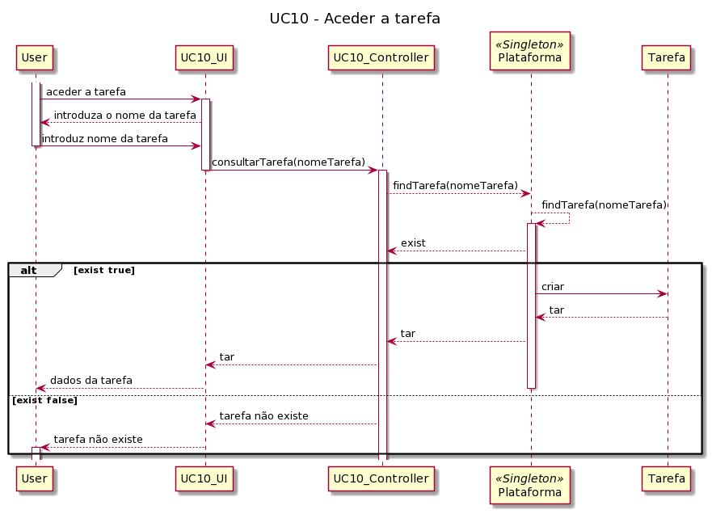
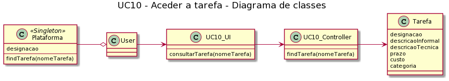

# UC10 - Aceder a Tarefa

##### [Voltar ao início](https://github.com/ajorgesantosp/upskill_java1_g1/blob/main/README.md)

## Formato Breve

O utilizador inicia a visualização das tarefas e escolhe a que pretende. O Sistema devolve os dados relativos a essa mesma tarefa.

## Formato Completo

**_Ator Primário_**

Qualquer um dos quatro tipos de utilizador

**_Partes interessadas e seus interesses:_**

- T4J: pretende que seja possível visualizar as características relativas a cada tarefa.
- Freelancer: pretende visualizar as tarefas disponíveis e aceder à que pretende, tendo, assim, acesso às características da mesma, decidindo se faz a sua candidatura.
- Colaboradores: pretendem visualizar o conteúdo das tarefas que introduziram, assim como pretendem que os freelancers possam visualizar as tarefas e se candidatem.
- Administrativo: pretendem visualizar as tarefas e ter conhecimento do conteúdo das mesmas.

**_Pré-condições:_**

1. O utilizador tem de estar registado na plataforma.
2. A tarefa tem de estar publicada.

**_Pós-condições_**
A tarefa é visualizada pelo utilizador.

**_Cenário de sucesso principal:_**

1. O utilizador inicia a consulta de uma tarefa.
2. O sistema solicita o nome da tarefa a consultar.
3. O utilizador insere o nome da tarefa.
4. O sistema devolve o conteúdo da tarefa escolhida.

**_Fluxos alternativos:_**

1. O colaborador cancela a visualização de tarefa.
   a. O caso de uso termina.
2. O sistema detecta que não existem tarefas publicadas.
   a. O caso de uso termina.

<<<<<<< HEAD

### UC10 - Diagrama de Sequência

=======
###UC10 - Diagrama de Sequência ###

> > > > > > > fe566d383e3d7c5538788778fc120a8508ca2c52
> > > > > > > 

### UC10 - Diagrama de Classes

# 
