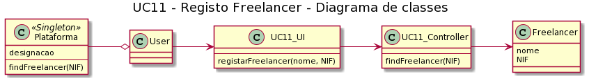

# UC11 - Registo de Freelancer

##### [Voltar ao início](https://github.com/ajorgesantosp/upskill_java1_g1/blob/main/README.md)

## Formato Breve

O administrativo regista um novo freelancer, validado, inserindo o seu nome, NIF, endereço postal, contacto telefónico e email. Para além destes atributos, indica as suas habilitações académicas, as competências técnicas e o respetivo grau de proficiência. O sistema solicita a validação dos dados e aquando da mesma, guarda os dados na base de dados e informa o administrativo de que o registo foi feito com sucesso.

## Formato Completo

**_Ator Primário_**

Administrativo

**_Partes interessadas e seus interesses:_**

- Administrativo: Pretende que os freelancers estejam registados na plataforma.
- T4J: pretende que a plataforma tenha freelancers registados.
- Freelancer:Pretende estar registado na plataforma.

**_Pré-condições:_**

1. O administrativo deve estar registado na plataforma.
2. A candidatura a freelancer deve estar validada

**_Pós-condições_**
O freelancer está registado na plataforma e pode candidatar-se a tarefas.

**_Cenário de sucesso principal:_**

1. O utilizador inicia a consulta de uma tarefa.
2. O sistema solicita o nome da tarefa a consultar.
3. O utilizador insere o nome da tarefa.
4. O sistema devolve o conteúdo da tarefa escolhida.

**_Fluxos alternativos:_**

1. O administrativo acede à lista de candidaturas válidas.
2. O administrativo faz o registo das candidaturas que pretende.
3. O sistema informa o administrativo que as candidaturas foram registadas com sucesso.

### UC11 - Diagrama de Sequência

### UC11 - Diagrama de Classes

