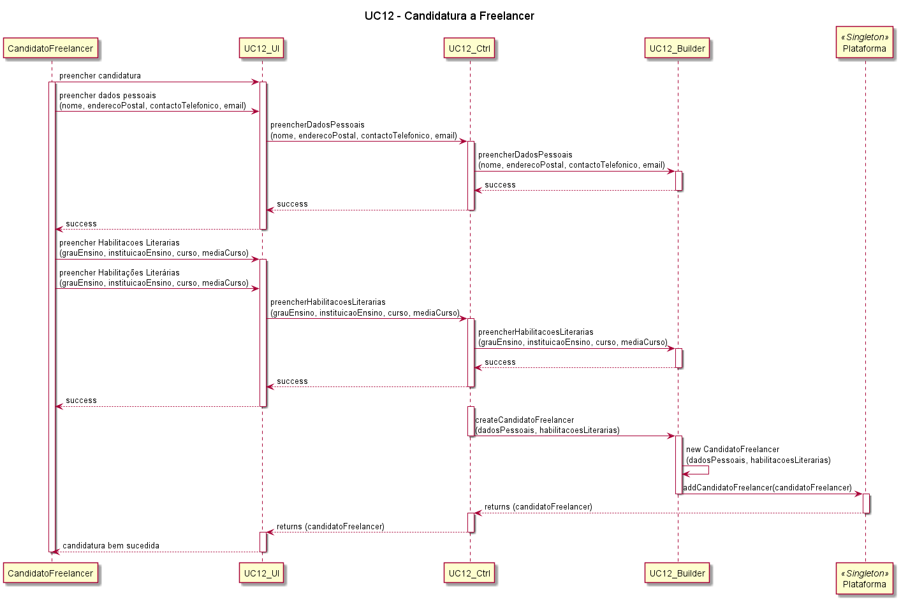
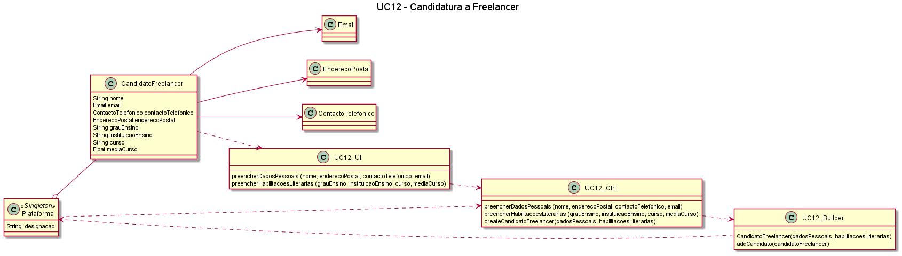

# UC12 - Candidatura a Freelancer

##### [Voltar ao início](https://github.com/ajorgesantosp/upskill_java1_g1/blob/main/README.md)

### Formato Breve

O candidato a freelancer acede à plataforma na secção de novos freelancers e preenche os dados solicitados: nome, endereço postal, contacto telefónico e email. Relativamente às suas habilitações literárias, preenche os dados relativos ao grau, à instituição que o atribuiu, designação do curso, e a média com que o finalizou. O sistema pede a confirmação dos dados, e o candidato confirma a introdução.

### Formato Completo

_Actor primário:_
Candidato a freelancer.  
_Partes interessadas e seus interesses:_
T4J: Pretende ter freelancers associados para que as organizações possam ter a quem adjudicar as suas tarefas.
Organização: Pretende que haja freelancers a quem possa adjudicar as suas tarefas.
Freelancer: Pretende candidatar-se na plataforma para que, futuramente, possa desempenhar tarefas para organizações.

_Pré-condições:_

1. A plataforma tem de ter disponibilizado um formulário para que o candidato a freelancer possa preencher com os seus dados.

_Pós-condições:_
O candidato a freelancer preenche a candidatura.
_Cenário de sucesso principal:_

1. O candidato a freelancer acede à plataforma.
2. O sistema solicita ao candidato a freelancer que preencha o formulário de dados pessoais.
3. O candidato a freelancer preenche o formulário com os seus dados, nomeadamente, nome, endereço postal, contacto telefónico e email.
4. O sistema pede a confirmação dos dados introduzidos.
5. O candidato confirma a introdução dos dados.
6. O sistema solicita ao candidato a freelancer que preencha a secção de habilitações literárias.
7. O candidato a freelancer indica o grau de ensino de que é titular, a instituição que o atribuiu, a designação do curso, e a média com que o finalizou.
8. O sistema pede a confirmação dos dados introduzidos.
9. O candidato a freelancer confirma a introdução dos dados.
10. O sistema solicita ao candidato a freelancer que confirme a submissão da candidatura.
11. O candidato a freelancer confirma a submissão da candidatura.
12. O sistema informa que a candidatura foi submetida com sucesso

_Fluxos alternativos:_

1. Dados pessoais mínimos obrigatórios em falta:
   a. O sistema informa quais os dados em falta.
   b. O sistema permite a introdução dos dados em falta (passo 3).
   c. O candidato a freelancer não introduz os dados em falta.
   i. O caso de uso termina.
2. Dados de habilitações literárias mínimos obrigatórios em falta:
   a. O sistema informa quais os dados em falta.
   b. O sistema permite a introdução dos dados em falta (passo 7).
   c. O candidato a freelancer não introduz os dados em falta.
   i. O caso de uso termina.
3. O sistema detecta que os dados (ou algum subconjunto dos dados) introduzidos devem ser únicos e já existem no sistema:
   a. O sistema alerta o candidato a freelancer para o facto.
   b. O sistema permite a sua alteração (passo 3 ou 7).
   c. O candidato a freelancer não introduz os dados.
   i. O caso de uso termina

### SSD

### Diagrama de Sequência

### Diagrama de Classes

