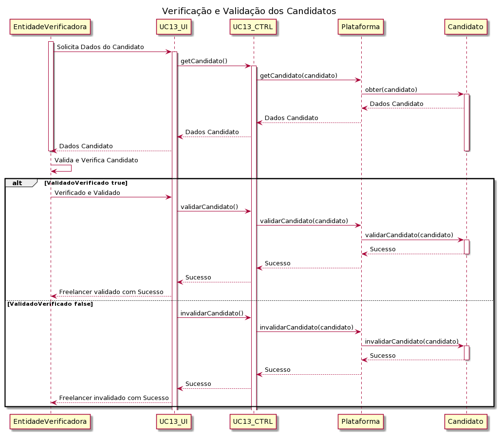

# UC13-Registar Organização

##### [Voltar ao início](https://github.com/ajorgesantosp/upskill_java1_g1/blob/main/README.md)

## 1. Engenharia de Requisitos

### Formato Breve

A entidade verificadora acede ao perfil do candidato a freelancer e procede à verificação e validação dos seus dados e competências atribuindo a cada uma um nível de proeficiência de acordo com os graus previamente definidos em cada competência técnica. Após o termino deste processo a entidade verificadora informa a plataforma da sua decisão considerando a veracidade dos dados/competências introduzidos pelo candidato a freelancer. O sistema devolve uma mensagem á entidade verificadora e envia notificação ao adminstrativo que existe um candidato válido para registar.

### Formato Completo

**Actor Principal:**

    Entidade Verificadora

**Partes interessadas e seus interesses:**

    Administrativo: Pretende que os candidatos a freelancers sejam válidos para que possam ser registados.

    T4J: pretende que a plataforma tenha freelancers válidos.
    Candidato a Freelancer:Pretende que a sua candidatura seja verificada e validada.

**Pré-condições:**

    A Entidade Verificadora tem de ter acesso aos dados dos candidatos.

    Tem de haver pelo menos um candidato a freelancer.

**Pós-condições:**

    A candidatura a freelancer é validada para ser registada.

**Cenário de sucesso principal:**

    A entidade acede aos dados do candidato a freelancer.

    A entidade verifica e valida todos os dados introduzidos pelo candidato(nome,NIF,endereço postal,contacto telefónico,e-mail).

    A entidade verifica e valida as habilitações nomeadamente(grau, designação do curso, instituição que concede o grau; média do curso).

    A entidade verifica as competências introduzidas pelo candidato e atribui um grau de proficiência a cada uma delas.

O
sistema informa a entidade que o candidato foi validado com sucesso.

**Fluxos alternativos:**

    A Entidade Verificadora cancela a verificação e validação do candidato.
        O caso de uso termina.
    O sistema detecta que não existem candidaturas por validar.
        O caso de uso termina.

#### SSD

##### Diagrama de Sequência

