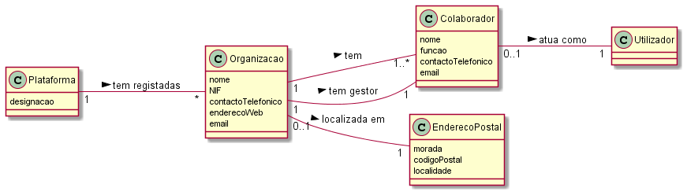

# UC1-Registar Organização

##### [Voltar ao início](https://github.com/pedro-miguez/upskill_java1_labprg_grupo3/blob/main/README.md)

## 1. Engenharia de Requisitos

### Formato Breve

Um utilizador afecto à organização inicia o registo da organização. O sistema solicita os dados necessários, nomeadamente o nome da organização, o número de identificação fiscal (NIF), o endereço postal, um contacto telefónico, um endereço web, um endereço de correio electrónico (email). O sistema solicita os dados do colaborador que ficará responsável pela especificação de outros colaboradores, nomeadamente o nome, função, contacto telefónico, e endereço de email.
O sistema valida e apresenta os dados ao colaborador da organização, pedindo que os confirme. O sistema guarda os dados na base de dados, e informa o colaborador da organização que o registo foi feito com sucesso.

#### SSD

##### Diagrama de Sequência

#### Diagrama de Classes

#### Excerto Modelo de Domínio

