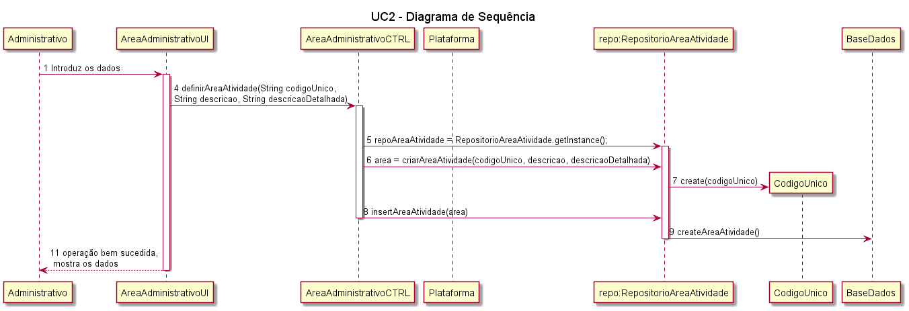
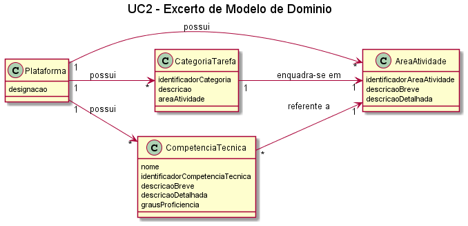

# UC2 - Definir Área de Atividade

##### [Voltar ao início](https://github.com/pedro-miguez/upskill_java1_labprg_grupo3/blob/main/README.md)

## 1. Engenharia de Requisitos

### Formato Breve

O administrativo inicia a definição de uma nova área de atividade. O sistema solicita os dados
necessários (i.e. código único e descrição breve e detalhada). O administrativo introduz os
dados solicitados. O sistema valida e apresenta os dados ao administrativo, pedindo que os
confirme. O administrativo confirma. O sistema regista os dados e informa o administrativo
do sucesso da operação.

#### SSD

##### Diagrama de Sequência

#### Diagrama de Classes

#### Excerto Modelo de Domínio

