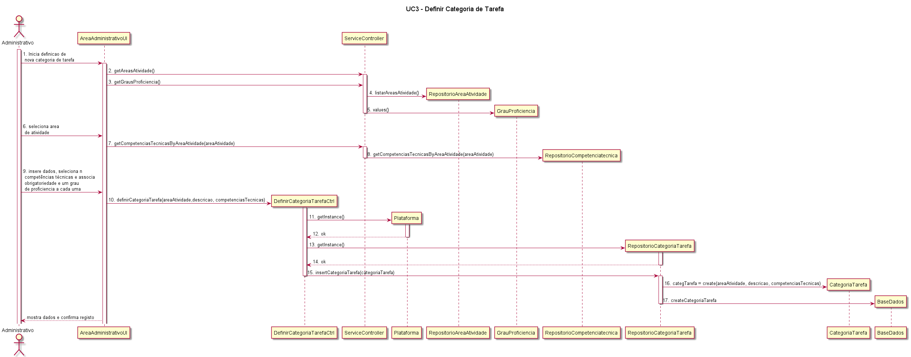

# UC3 – Definir Categoria de Tarefa 

##### [Voltar ao início](https://github.com/pedro-miguez/upskill_java1_labprg_grupo3/blob/main/README.md)

## Formato Breve:  

O administrativo define uma categoria de tarefa, indicando em sistema os dados necessários solicitados (área de atividade na qual se insere, uma descrição e a lista de competências técnicas (obrigatórias ou desejáveis, com um grau mínimo associado a cada uma), transversais às tarefas dentro da categoria de tarefa em questão). O sistema gera automaticamente um identificador e valida a informação indicada. O sistema apresenta ao administrativo os dados submetidos, e este confirma a adição da categoria de tarefa. O sistema confirma o sucesso na criação da nova categoria de tarefa.

#### SSD

##### Diagrama de Sequência

#### Diagrama de Classes

#### Excerto Modelo de Domínio

