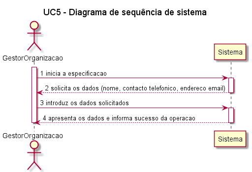
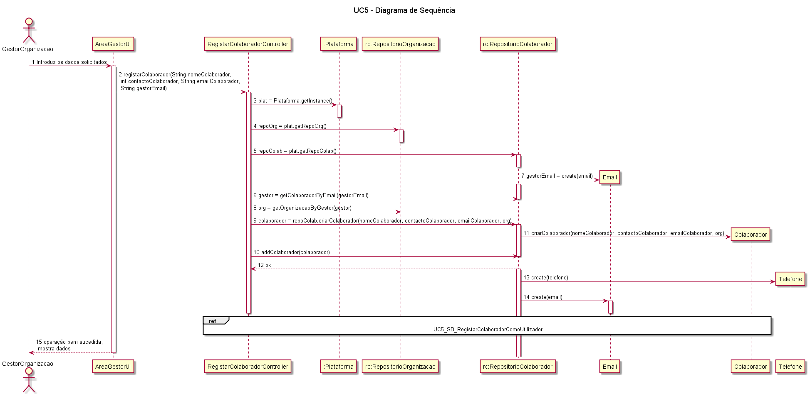

# UC5 – Especificar Colaboradores da Organização  

##### [Voltar ao início](https://github.com/pedro-miguez/upskill_java1_labprg_grupo3/blob/main/README.md)

## Formato Breve  

O gestor da organização acede à plataforma, através dos seus dados de login (email e password) e preenche os campos fornecidos pelo sistema para indicar um novo colaborador da organização na plataforma.

### Diagrama de sequência de Sistema (SSD) 

### Diagramas de sequência 

### Diagrama de classes 

