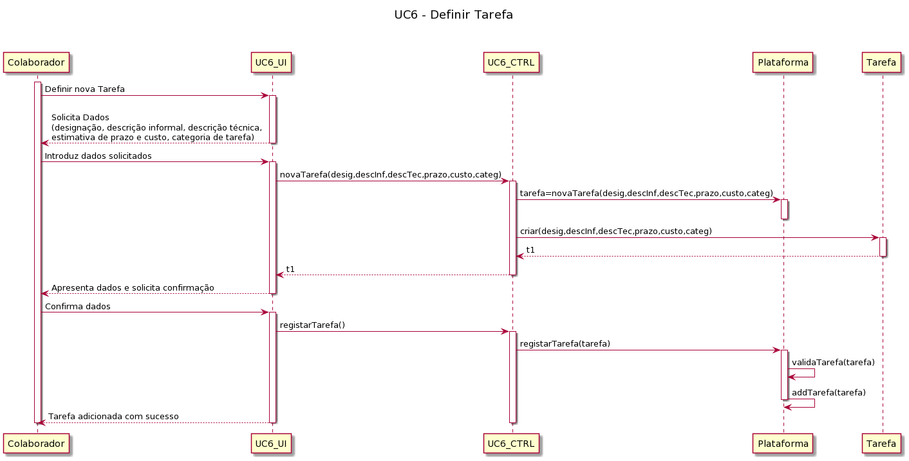
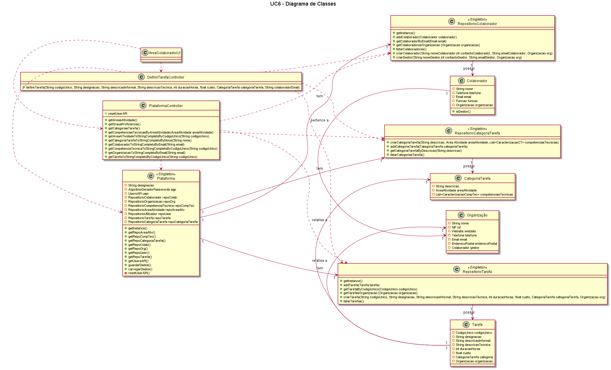

# UC6 – Especificar Tarefa 

##### [Voltar ao início](https://github.com/pedro-miguez/upskill_java1_labprg_grupo3/blob/main/README.md)

## Formato Breve:  

O colaborador da organização inicia a criação no sistema uma nova tarefa. O sistema solicita a introdução de uma designação, uma descrição informal, uma descrição técnica, uma estimativa de prazo e custo, e uma categoria para inserir a tarefa. O colaborador da organização insere os dados. O sistema apresenta os dados inseridos ao utilizador e pede a confirmação. O colaborador da organização confirma os dados. O sistema regista os dados e informa o colaborador da organização do sucesso desta operação

#### SSD

##### Diagrama de Sequência

#### Diagrama de Classes

#### Excerto Modelo de Domínio

