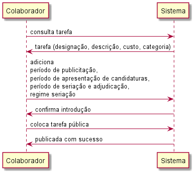
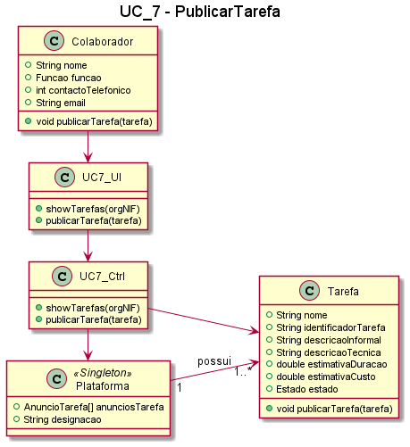

# UC7 - Publicar Tarefa

##### [Voltar ao início](https://github.com/ajorgesantosp/upskill_java1_g1/blob/main/README.md)

### Formato Breve

O colaborador da organização acede à área de publicação de tarefas, seleccionando uma tarefa que esteja por publicar, da lista apresentada pelo sistema. O colaborador indica qual o período durante o qual o anúncio vai estar publicado na plataforma (período de publicitação), o período durante o qual os freelancers se podem candidatar ao anúncio (período de apresentação de candidaturas), o período durante o qual será feita a seriação das candidaturas e a adjudicação, e o tipo de regimento de seriação aplicável. O sistema apresenta os dados introduzidos, e o colaborador da organização confirma essa introdução. O sistema valida a selecção, tornando a tarefa pública.

### Formato Completo

_Ator primário:_

- Colaborador da organização.

_Partes interessadas e seus interesses:_

- Organização: pretende consultar e analisar uma tarefa previamente introduzida para a poder publicar.
- T4J: pretende que sejam publicadas tarefas na plataforma para que posteriormente sejam feitas candidaturas às mesmas.
- Freelancer: pode candidatar-se a tarefas que tenham sido publicadas.

_Pré condições:_

- O colaborador deve estar registado na plataforma;

_Pós condições:_

- A tarefa deve estar publicada na plataforma;

**Cenário de sucesso principal**

1. O colaborador acede à área de publicação de tarefas.
2. O sistema verifica se a organização tem tarefas por publicar.
3. O sistema confirma que existem tarefas por publicar e retorna uma lista das mesmas.
4. O colaborador seleciona uma tarefa para publicar.
5. O sistema solicita a introdução de:
   a. Período de publicitação;
   b. Período de apresentação de candidaturas;
   c. Período de seriação e adjudicação.
6. O colaborador introduz os dados solicitados.
7. O sistema confirma a introdução.
8. O sistema torna a tarefa pública, e valida a sua publicação.
9. O sistema retorna uma mensagem de sucesso: a tarefa foi publicada.
10. O colaborador termina o processo.

**Extensões (ou fluxos alternativos):**

1. O sistema não encontra tarefas por publicar relativas à organização do colaborador. O caso de uso termina.
2. Dados mínimos obrigatórios em falta:
   a. O sistema informa quais os dados em falta.
   b. O sistema permita a introdução dos dados em falta (passo 4).
   c. O colaborador da organização não introduz os dados em falta. O caso de uso termina.

#### SSD

#### Diagrama de Sequência

#### Diagrama de Classe

