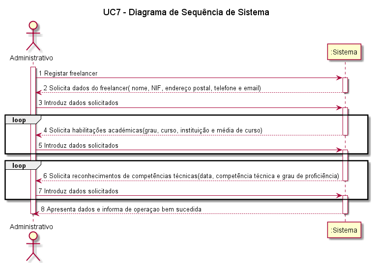

# UC7 – Registar Freelancer 

##### [Voltar ao início](https://github.com/pedro-miguez/upskill_java1_labprg_grupo3/blob/main/README.md)

## Formato Breve:  

O administrativo inicia o registo de um freelancer. O sistema solicita os dados que caracterizam o freelancer (i.e., o nome, o NIF, o endereço postal, um contacto telefónico e email, as suas habilitações académicas (grau, designação do curso, instituição que concedeu o grau e média do curso) e os reconhecimentos de competências técnicas (data, competência técnica, grau de proficiência) que lhe foram atribuídos. O administrador introduz os dados solicitados. O sistema valida e apresenta os dados, pedindo que os confirme. O administrador confirma. O sistema regista os dados do freelancer, cria um utilizador para o freelancer e envia-lhe por e-mail os dados de acesso à plataforma e, por fim, informa o administrativo do sucesso da operação.

#### SSD

##### Diagrama de Sequência

#### Diagrama de Classes

#### Excerto Modelo de Domínio

