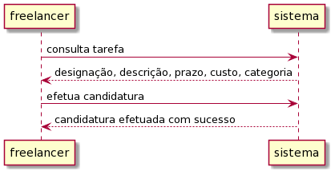
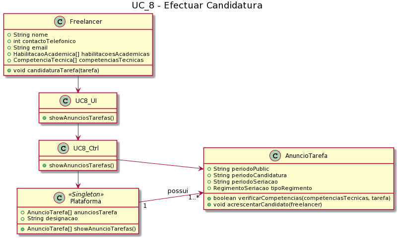

# UC8 – Efectuar candidatura 

##### [Voltar ao início](https://github.com/ajorgesantosp/upskill_java1_g1/blob/main/README.md)

## Formato Breve:  

O freelancer, tendo as competências técnicas necessárias para a tarefa indicada, submete a sua candidatura à mesma. O sistema devolve uma mensagem, confirmando que a candidatura foi bem sucedida e fica a aguardar adjudicação por parte da organização.

## Formato Completo:  

### Ator primário: 

Freelancer

### Partes interessadas e seus interesses: 

Organização: pretende que as suas tarefas sejam realizadas por Freelancers.
T4J: pretende que os Freelancers realizem tarefas na sua plataforma, e para tal precisam e passar pelo processo de seleção.
Freelancer: pretende realizar tarefas publicadas na tarefa

### Pré condições: 

O Freelancer deve estar registado na plataforma, e ter as suas competências técnicas e habilitações verificadas;
É necessário que existam anúncios de tarefa em período de candidatura.;
Têm de haver organizações registadas na plataforma para que possam haver tarefas publicadas;

### Pós condições: 

O Freelancer candidatou-se a uma dada tarefa com sucesso, constando na lista de Freelancers que irá passar pelo processo de seriação;

### Cenário de sucesso principal: 

1. O Freelancer acede à area de anúncios de tarefa;
2. O sistema verifica e devolve uma lista de tarefas disponíveis para candidatura.
3. O Freelancer candidata-se a uma das tarefas disponíveis;
4. O sistema verifica se o Freelancer tem as competências mínimas exigidas, com grau equivalente ao requerido.
5. Caso se confirme que sim, o sistema informa o Freelancer do sucesso da sua candidatura.

### Extensões (ou fluxos alternativos): 

1. O período de candidatura termina antes que o Freelancer confirme a sua candidatura.
   a. O caso de uso termina.
2. O sistema verifica que o Freelancer não possui as competências técnicas exigidas para se candidatar à tarefa que pretende.
   a. O sistema informa o utilizador das competências em falta.
   b. O caso de uso termina
3. O sistema verifica que não existem de momento tarefas disponíveis para candidatura.
   a. O caso de uso termina.

### Diagrama de sequência de Sistema (SSD) 

### Diagrama de sequência 

### Diagrama de classes 

