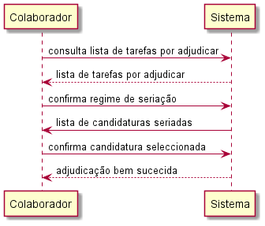
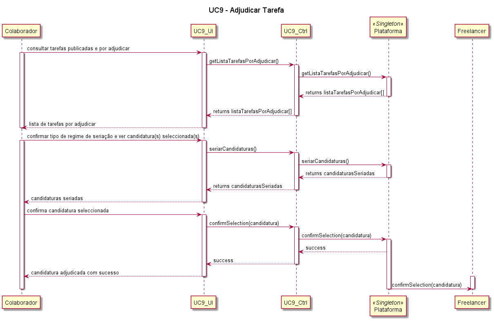
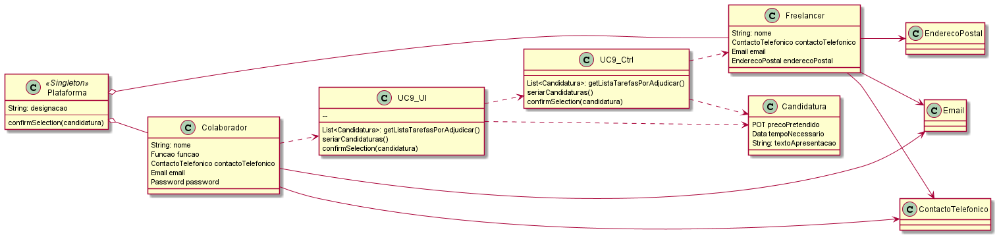

# UC9 – Adjudicar Tarefa

### Formato breve:
O colaborador da organização inicia o processo de adjudicação de uma tarefa publicada. O sistema apresenta a lista das tarefas previamente publicadas ainda por adjudicar, o regime de seriação e a(s) candidatura(s) resultante(s) dessa seriação. Se tiver sido seleccionada a seriação subjectiva com atribuição opcional, o colaborador da organização analisa as candidaturas existentes e, se existir pelo menos uma candidatura que cumpra os requisitos previamente definidos pela organização, adjudica a tarefa à melhor candidatura. Se tiver sido seleccionada a seriação subjectiva com atribuição obrigatória, o colaborador da organização tem de adjudicar a tarefa a uma candidatura, ainda que esta possa não cumprir todos os requisitos previamente definidos pela organização. Se tiver sido seleccionada a atribuição automática, o colaborador da organização recebe do sistema a informação sobre a candidatura com o segundo preço mais baixo, que foi seleccionada. Após confirmar a adjudicação, o colaborador do sistema recebe uma mensagem de adjudicação bem-sucedida, e o freelancer recebe a mensagem de que foi seleccionado para aquela tarefa.

### Formato completo:
*Actor primário:*
* Colaborador da organização.

*Partes interessadas e seus interesses:*
* Colaborador da organização: pretende adjudicar a tarefa publicada a um candidato (freelancer) que tenha apresentado as competências necessárias para a realizar, assim como o melhor preço e tempo de execução.
* T4J: pretende que a plataforma atribua com sucesso as tarefas publicadas por organizações, a candidatos (freelancers) que se propõem a realizá-las.

*Pré-condições:*
* O colaborador da organização tem de estar registado na plataforma.
* A tarefa tem de estar publicada.
* A tarefa não pode ainda ter sido adjudicada.
* Tem de existir pelo menos uma candidatura à oferta supra indicada.
* Os critérios necessários para a seriação são previamente definidos pela organização.

*Pós-condições*
* A tarefa é atribuída a um candidato (freelancer) para sua realização.

**Cenário de sucesso principal**
1.	O colaborador da organização consulta a lista de tarefas publicadas e por adjudicar. 
2.	O colaborador da organização verifica o tipo de regime aplicado à seriação de candidaturas para a tarefa.
a.	No caso de seriação subjectiva com atribuição opcional, se não houver nenhuma candidatura que preencha os critérios definidos, não é seleccionada nenhuma candidatura.
b.	No caso de seriação subjectiva com atribuição obrigatória, o colaborador selecciona um freelancer, que cumpra os requisitos definidos pela organização, para a realização da tarefa.
c.	No caso de atribuição automática, o sistema atribui a tarefa ao freelancer que tenha apresentado o segundo preço mais baixo.
3.	O sistema devolve uma mensagem de que a adjudicação foi feita com sucesso e envia mensagem para o freelancer a informar que foi selecionado para a tarefa à qual se candidatou.

**Extensões (ou fluxos alternativos):**
1.	O colaborador cancela a adjudicação de tarefa.
a.	O caso de uso termina.
2.	O sistema detecta que não existem tarefas publicadas por adjudicar.
a.	O caso de uso termina.
3.	O sistema detecta que não existem tarefas publicadas.
a.	O caso de uso termina.
4.	O sistema detecta que a tarefa que o colaborador pretende adjudicar já foi adjudicada.
a.	O caso de uso termina.

#### SSD

#### Diagrama de Sequência

#### Diagrama de Classes

