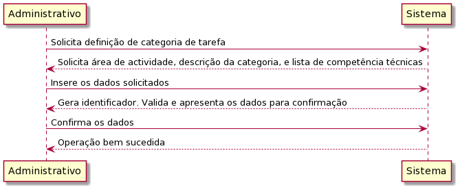
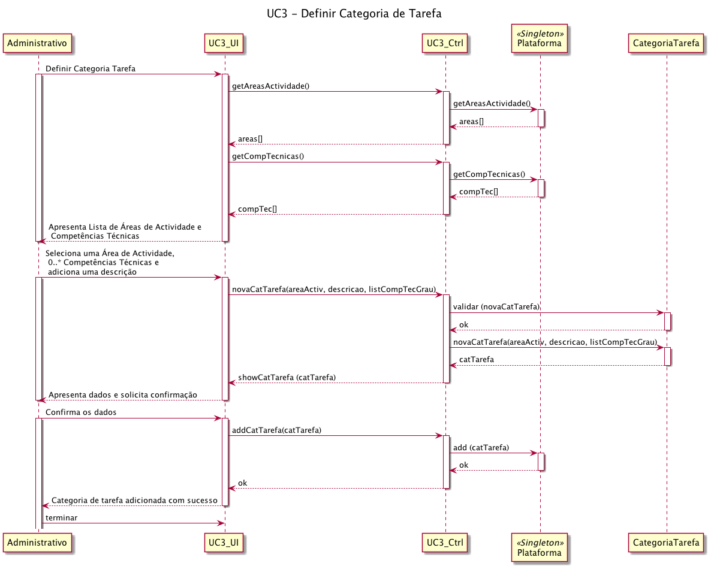

# UC3 – Definir Categoria de Tarefa 

##### [Voltar ao início](https://github.com/ajorgesantosp/upskill_java1_g1/blob/main/README.md)

## Formato Breve:  

O administrativo define uma categoria de tarefa, indicando em sistema os dados necessários solicitados (área de atividade na qual se insere, uma descrição e a lista de competências técnicas (obrigatórias ou desejáveis, com um grau mínimo associado a cada uma), transversais às tarefas dentro da categoria de tarefa em questão). O sistema gera automaticamente um identificador e valida a informação indicada. O sistema apresenta ao administrativo os dados submetidos, e este confirma a adição da categoria de tarefa. O sistema confirma o sucesso na criação da nova categoria de tarefa.

## Formato completo:  

### Actor primário: 

Administrativo

### Partes interessadas e seus interesses: 

Administrativo: pretende criar categorias de tarefa uma vez que a existência delas é um requisito para a criação de tarefas na plataforma.
Colaborador da organização: pretende ter uma oferta variada de categorias de tarefa às quais possa associar as tarefas que cria.
T4J: pretende que a plataforma atribua com sucesso as tarefas publicadas por organizações, a candidatos (freelancers) que se propõem a realizá-las.

### Pré-condições: 

1. A plataforma tem que ter pelo menos um Administrativo registado.
2. É necessário que já exista pelo menos uma área de actividade à qual se possam associar categorias de tarefas.
3. É necessário que existam competências técnicas definidas que possam ser associadas às diferentes categorias de tarefas.

### Pós-condições: 

É criada/definida com sucesso uma categoria de tarefa, que fica disponível para a associação de tarefas.

### Cenário de sucesso principal: 

1. O administrativo inicia o processo de definição de categoria de tarefa.
2. A plataforma devolve a lista de áreas de actividade e competências técnicas existentes na plataforma.
3. O administrativo seleciona uma área de actividade, juntamente com as competências técnicas, definindo o grau mínimo exigido para as mesmas, assim como se são obrigatórias ou opcionais.
4. O administrativo insere o nome da categoria de tarefa assim como a sua descrição.
5. A plataforma valida os dados.
6. Depois de validados os dados, a plataforma retorna os dados ao administrativo para que este confirme o registo desta categoria de tarefa.
7. O Administrativo confirma o registo, e a categoria de tarefa é então registada na plataforma.
8. O caso de uso termina.

### Fluxos alternativos: 

1. A plataforma não tem nenhuma área de actividade definida.
   a. O caso de uso termina.
2. A plataforma não tem nenhuma categoria de tarefa definida.
   a. O caso de uso termina.
3. O administrador não pretende associar nenhuma competência técnica à categoria de tarefa, associando a categoria de tarefa apenas a uma área de actividade
   a. O caso de uso decorre de acordo com o fluxo principal, mas não são escolhidas, inseridas, nem validadas competência técnicas associadas a esta categoria de tarefa.
4. O sistema detecta algum erro durante a validação dos dados.
   a. O sistema solicita ao administrador a correção dos erros.
   b. O caso de uso decorre de acordo com o fluxo principal.

### Diagrama de sequência de Sistema (SSD) 

### Diagrama de sequência 

### Diagrama de classes 

