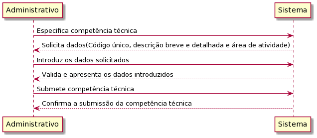
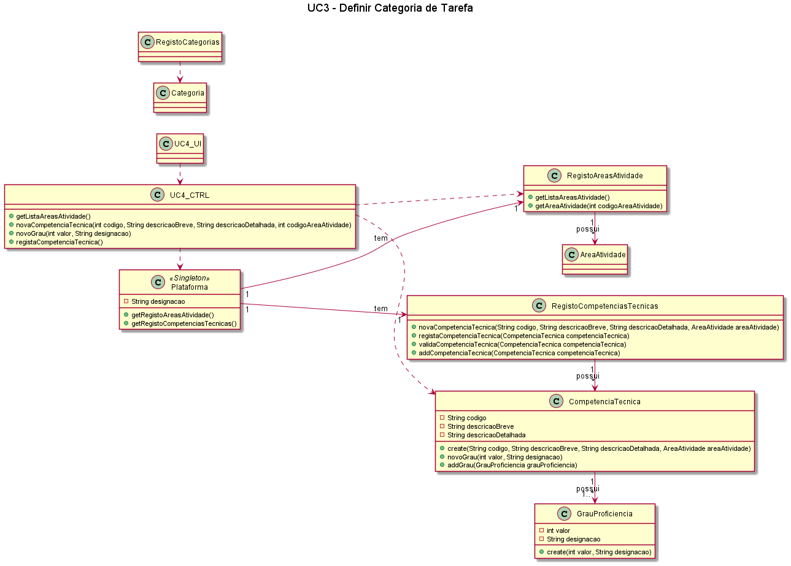

# UC4 – Especificar Competência Técnica 

##### [Voltar ao início](https://github.com/ajorgesantosp/upskill_java1_g1/blob/main/README.md)

## Formato Breve:  

O administrativo especifica uma competência técnica, indicando em sistema os dados necessários solicitados (um código único, uma descrição breve e outra mais detalhada, a área de atividade a qual corresponde e os respectivos graus de proficiência). A informação é validada e apresentada ao administrativo que confirma a adição da competência técnica. O sistema confirma o sucesso na criação da nova competência técnica.

## Formato completo:  

### Actor primário: 

Administrativo

### Partes interessadas e seus interesses: 

Administrativo: Pretende que a competência técnica fique registada na plataforma
Plataforma: Pretende ter mais competências técnicas registadas na plataforma
Freelancer: Pretende ter competências técnicas inseridas na plataforma

## Pré-condições: 

1. A plataforma tem que ter pelo menos um Administrativo registado.
2. É necessário haver pelo menos uma área de atividade inserida na plataforma.

## Pós-condições: 

A competência técnica é definida com sucesso, que fica disponível na plataforma.

## Cenário de sucesso principal: 

1. O administrativo inicia o processo de definição de uma competência técnica.
2. O sistema solicita os dados.
3. O Administrativo introduz os dados.
4. O sistema solicita a confirmação dos dados.
5. O Administrativo confirma os dados.
6. O sistema devolve mensagem a confirmar o sucesso da operação.

## Fluxos alternativos: 

1. O Administrativo cancela o processo de definir uma competência técnica.
   a. O caso de uso termina.
2. O Administrativo verifica que não existem mais competências técnicas para definir.
   a. O caso de uso termina.
3. O Administrativo introduz dados inválidos:
   a. O sistema permite a correção dos dados introduzidos (Passo 3).
   b. O Administrativo não altera os dados.
   c. O caso de uso termina.
4. O sistema deteta que os dados (ou algum subconjunto dos dados) introduzidos devem ser únicos e que já existem no sistema:
   a. O sistema alerta o gestor para o facto.
   b. O sistema permite a sua alteração (passo 3).
   c. O Administrativo não altera os dados. O caso de uso termina.

### Diagrama de sequência de Sistema (SSD) 

### Diagrama de sequência 

### Diagrama de classes 

