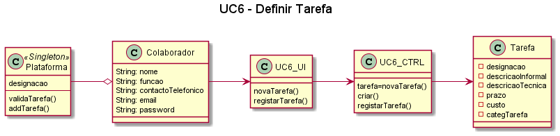

# UC6 – Especificar Tarefa 

##### [Voltar ao início](https://github.com/ajorgesantosp/upskill_java1_g1/blob/main/README.md)

## Formato Breve:  

O colaborador da organização inicia a criação no sistema uma nova tarefa. O sistema solicita a introdução de uma designação, uma descrição informal, uma descrição técnica, uma estimativa de prazo e custo, e uma categoria para inserir a tarefa. O colaborador da organização insere os dados. O sistema apresenta os dados inseridos ao utilizador e pede a confirmação. O colaborador da organização confirma os dados. O sistema regista os dados e informa o colaborador da organização do sucesso desta operação

## Formato completo:  

### Actor primário: 

Colaborador da Organização

### Partes interessadas e seus interesses: 

Colaborador da Organização: Pretende que a sua tarefa seja criada.
Plataforma: Pretende ter tarefas criadas para que possam ser publicadas.
Organização: Pretende ter tarefas definidas para que possam ser publicadas e posteriormente adjudicadas a Freelancers.

### Pré-condições: 

1. A Organização tem de estar registada.
2. O Colaborador tem de estar registado como membro de uma Organização.

### Pós-condições: 

A tarefa fica registada na plataforma.

### Cenário de sucesso principal: 

1. O Colaborador inicia o processo de criação/definição de tarefa.
2. O sistema solicita os dados.
3. O Colaborador introduz os dados.
4. O sistema verifica e solicita confirmação dos dados.
5. O Colaborador confirma os dados.
6. O sistema devolve mensagem de operação concluída com sucesso.

## Fluxos alternativos: 

1. O Colaborador cancela o processo de criação/definição de tarefa.
   a. O caso de uso termina.
2. O Colaborador verifica que não existem mais tarefas para criar/definir.
   a. O caso de uso termina.
3. O Colaborador introduz dados inválidos:
   a. O sistema permite a correção dos dados introduzidos (Passo 3).
   b. O Colaborador não altera os dados.
   c. O caso de uso termina.
4. O sistema deteta que os dados (ou algum subconjunto dos dados) introduzidos devem ser únicos e que já existem no sistema:
   a. O sistema alerta o gestor para o facto.
   b. O sistema permite a sua alteração (passo 3).
   c. O Colaborador não altera os dados. O caso de uso termina.

### Diagrama de sequência de Sistema (SSD) 

### Diagrama de sequência 

### Diagrama de classes 

